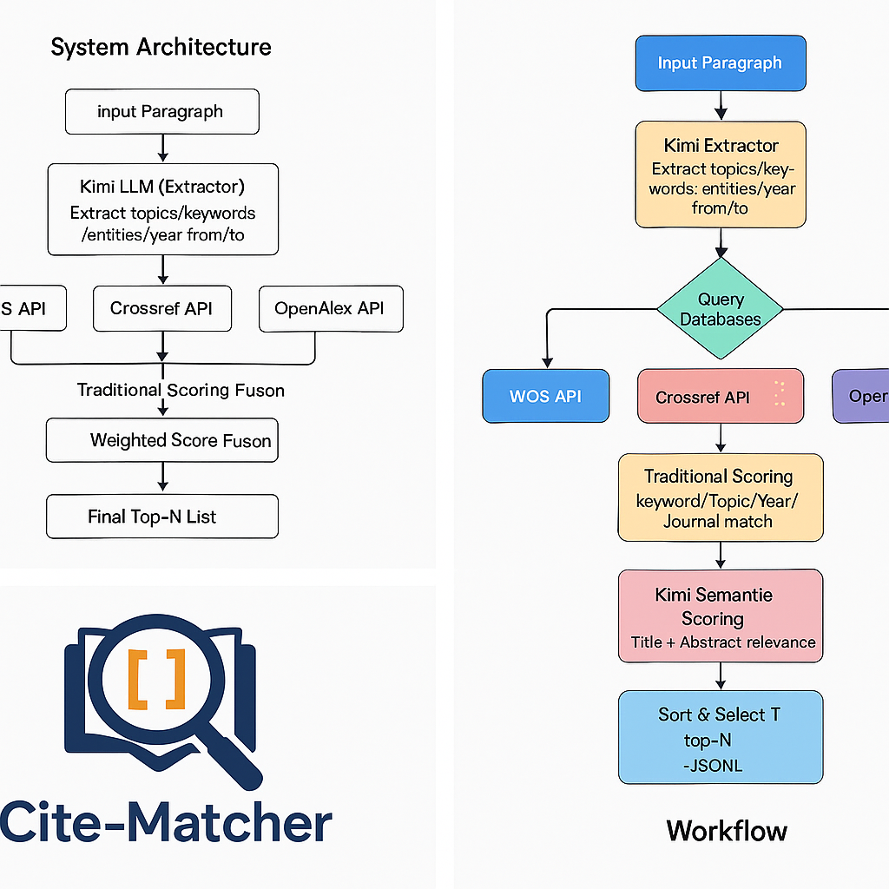

# 📚 CitationFinder: 自动化学术引用匹配系统  
**Automatic Citation Retrieval & Ranking System (WOS + Crossref + OpenAlex + Kimi LLM)**
本项目旨在解决写论文时 “根据一段文本自动找到最相关的学术文献” 这一痛点。 系统综合利用大型语言模型（Kimi）、WOS API、Crossref、OpenAlex 和 Unpaywall，实现从文本 → 检索意图 → 多源检索 → 评分 → 输出 BibTeX/RIS** 的自动化流程
This project addresses the pain point of automatically identifying the most relevant academic literature based on a given text when writing papers. The system integrates large language models (Kimi), WOS API, Crossref, OpenAlex, and Unpaywall to automate the entire workflow: text → retrieval intent → multi-source search → scoring → outputting BibTeX/RIS.
### Author: Ruoyu Tang

---

## 🚀 功能特性 | Features

| 功能 / Feature | 说明 / Description |
|:--|:--|
| 🎯 **语义理解** | 使用 Kimi 从段落中抽取主题、关键词、时间范围。<br>Uses Kimi LLM to extract topics, keywords, and time windows. |
| 🌐 **多源检索** | 并行调用 Web of Science、Crossref、OpenAlex 检索元数据与 DOI。<br>Searches multiple scholarly APIs in parallel. |
| 🧮 **智能打分** | 按关键词、主题、期刊白名单、时效性计算文献相关度。<br>Ranks papers by relevance and quality heuristics. |
| 🟢 **开放获取标注** | 调用 Unpaywall 标注 OA 状态并返回可访问链接。<br>Checks open-access availability using Unpaywall. |
| 📦 **结构化导出** | 输出 `.jsonl` 与 `.bib` 文件，便于导入 Zotero 或 LaTeX。<br>Exports both JSONL and BibTeX formats. |

## 🗂️ 项目文件结构 | Project Structure

| 文件 | 功能 / Purpose |
|:--|:--|
| `config.yaml` | 全局配置：API Keys、模型、年份窗、白名单期刊、输出目录。<br>Global configuration file for all APIs and settings. |
| `kimi_extract_query.py` | 调用 Kimi 提取段落检索意图（topics、keywords、entities）。<br>Kimi-based extractor for search intent. |
| `cite_matcher.py` | 主程序：检索、融合、打分、OA 标注、输出结果。<br>Main pipeline for search, ranking, OA labeling, export. |
| `out/` | 存放输出结果 (`.jsonl` & `.bib`)。<br>Output directory for reference files. |

---

## 🧠 核心流程 | Core Workflow

1. **段落输入 / Input Paragraph**  
   中英文均可，可为论文摘要或正文片段。

2. **Kimi 意图抽取 / Intent Extraction**  
   输出包含主题 (`topics`)、关键词 (`keywords`)、时间窗 (`year_from/to`) 的结构化 JSON。

3. **多源文献检索 / Multi-source Search**  
   组合关键词在 WOS、Crossref、OpenAlex 中检索，并获取 DOI。

4. **融合去重 / Data Fusion**  
   以 DOI 作为唯一主键合并不同来源结果。

5. **打分排序 / Relevance Scoring**  
   按以下指标加权评分：  
   - 关键词命中 (2.0)  
   - 主题命中 (1.5)  
   - 期刊白名单 (1.2)  
   - 标题重合 (1.0)  
   - 时效性加成 (2.0 × recency)

6. **开放获取检查 / Open-Access Tagging**  
   调用 Unpaywall 标注 `is_oa` 与 `oa_url`。

7. **结果输出 / Export Results**  
   输出 Top-N 条记录到：  
   - `out/candidate_refs.jsonl`  
   - `out/candidate_refs.bib`

---

## ⚙️ 安装与运行 | Installation & Usage

### 1️⃣ 安装依赖 / Install dependencies

```bash
pip install openai requests pyyaml
```

### 2️⃣ 编辑配置文件 / Edit config.yaml

```bash
填写以下内容：
Kimi API Key（Moonshot 平台）
Web of Science API Key
Crossref polite_email
Unpaywall 邮箱
```

### 3️⃣ 运行程序 / Run the program

```bash
# 输入一段文本
python cite_matcher.py --text "我们研究喷气发动机润滑油在高温下的成核机制..."

# 或从文件读取
python cite_matcher.py --file paragraph.txt
```

📜 License
MIT License